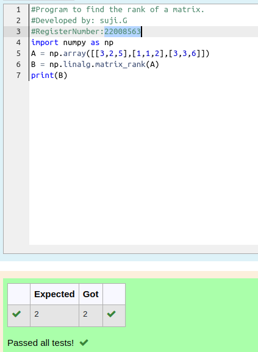

# RANK-OF-A-MATRIX
## Aim:
To write a python program to find the rank of a matrix
## Equipment’s required:
1. 	Hardware – PCs
2. 	Anaconda – Python 3.7 Installation / Moodle-Code Runner
## Algorithm:
### Step 1: Import numpy
### Step 2: Assign np.numpy()
### Step 3: Using np.linalg solve()
### Step 4: End the program
## Program:
```#Program to find the rank of a matrix.
#Developed by: suji.G
#RegisterNumber:22008563
import numpy as np
A = np.array([[3,2,5],[1,1,2],[3,3,6]])
B = np.linalg.matrix_rank(A)
print(B)
```
## Output:


## Result:
Thus the rank for the given matrix is successfully solved by  using a python program.

